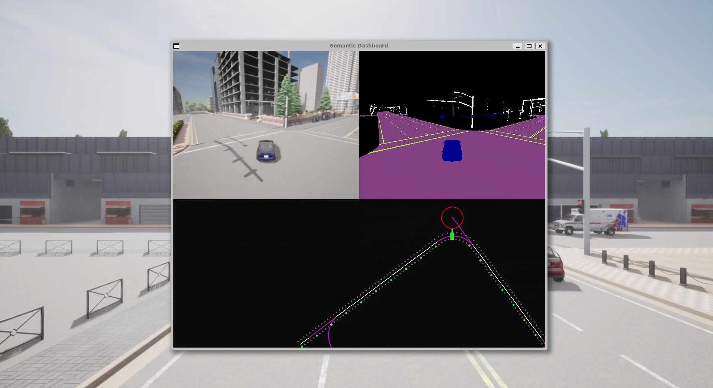

# CarlaVision Dashboard



A real-time autonomous driving dashboard built with [CARLA Simulator](https://carla.org/) and Pygame, designed for visualizing sensor data, road structure, and vehicle dynamics in simulated urban environments.

## Features

- **Semantic Segmentation Visualization:** Real-time display of semantic camera output, highlighting roads, road lines, poles, and all vehicle types.
- **RGB Camera Feed:** True-color camera view matching CARLA’s spectator mode.
- **Lane & Intersection Detection:** Dynamic lane drawing and intersection branch visualization using CARLA waypoints.
- **Vehicle Tracking:** Nearby vehicle detection, relative positioning, and Time-to-Collision (TTC) calculation.
- **Custom Dashboard Layout:** Landscape interface with sensor views on top and a full-width dashboard below for optimal situational awareness.
- **Traffic Manager Integration:** Automated vehicle control for realistic traffic simulation.

## Installation

1. **Clone the repository:**
   ```bash
   git clone https://github.com/yourusername/carlavision-dashboard.git
   cd carlavision-dashboard

2. **Install dependencies:**
   - [CARLA Simulator](https://carla.org/)
   - Python packages:
     ```bash
     pip install pygame numpy
     ```

3. **Start CARLA server:**
   ```bash
   ./CarlaUE4.sh
   ```

4. **Run the dashboard:**
   ```bash
   python code.py
   ```

## Usage

- The dashboard displays:
  - Top-left: Semantic segmentation camera
  - Top-right: RGB camera
  - Bottom: Dashboard with lane, intersection, and vehicle visualization
- All vehicles are managed by CARLA’s Traffic Manager for realistic movement.
- The dashboard is fully interactive and updates in real time.


## License

This project is licensed under the MIT License.

## Acknowledgements

- [CARLA Simulator](https://carla.org/)
- [Pygame](https://www.pygame.org/)
- [NumPy](https://numpy.org/)

